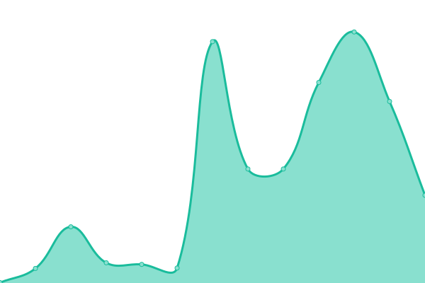
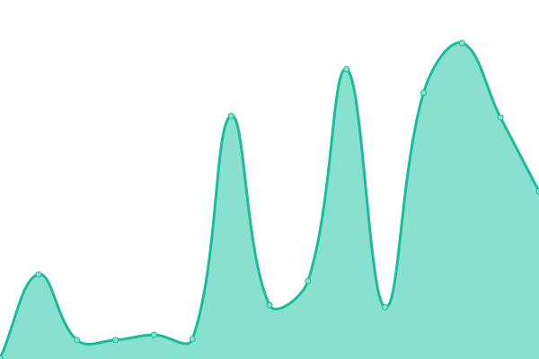
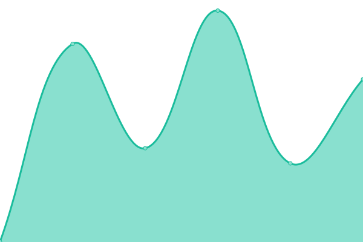

# [📈 Live Status](https://stg-status.urbanladder.com): <!--live status--> **🟧 Partial outage**

This repository contains the open-source uptime monitor and status page for [Upptime](https://upptime.js.org), powered by [Upptime](https://github.com/upptime/upptime).

With [Upptime](https://upptime.js.org), you can get your own unlimited and free uptime monitor and status page, powered entirely by a GitHub repository. We use [Issues](https://github.com/upptime/upptime/issues) as incident reports, [Actions](https://github.com/SVMadhavaReddy/upptime/actions) as uptime monitors, and [Pages](https://stg-status.urbanladder.com) for the status page.

<!--start: status pages-->
<!-- This summary is generated by Upptime (https://github.com/upptime/upptime) -->
<!-- Do not edit this manually, your changes will be overwritten -->
<!-- prettier-ignore -->
| URL | Status | History | Response Time | Uptime |
| --- | ------ | ------- | ------------- | ------ |
|  [Staging - Hercules](https://stg1-hercules.urbanladder.com/api/health_check_lite) | 🟩 Up | [staging-hercules.yml](https://github.com/SVMadhavaReddy/upptime/commits/HEAD/history/staging-hercules.yml) | 

 151ms
     
 | 

<a href="https://stg-status.urbanladder.com/history/staging-hercules">94.31%</a>
    

|  [Staging - Wulverine](https://stg1-wulverine.urbanladder.com/admin/login) | 🟩 Up | [staging-wulverine.yml](https://github.com/SVMadhavaReddy/upptime/commits/HEAD/history/staging-wulverine.yml) | 

 133ms
     
 | 

<a href="https://stg-status.urbanladder.com/history/staging-wulverine">100.00%</a>
    

|  [Staging - Birbul](https://stg-birbul.urbanladder.com) | 🟥 Down | [staging-birbul.yml](https://github.com/SVMadhavaReddy/upptime/commits/HEAD/history/staging-birbul.yml) | 

 506ms
     
 | 

<a href="https://stg-status.urbanladder.com/history/staging-birbul">99.97%</a>
    

<!--end: status pages-->

[**Visit our status website →**](https://stg-status.urbanladder.com)

## 📄 License

- Powered by: [Upptime](https://github.com/upptime/upptime)
- Code: [MIT](./LICENSE) © [Upptime](https://upptime.js.org)
- Data in the `./history` directory: [Open Database License](https://opendatacommons.org/licenses/odbl/1-0/)
